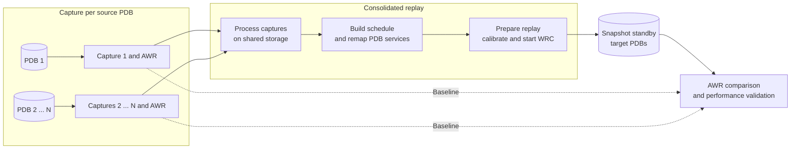

# Consolidated Replay in Oracle RAT

[English](./README-oracle-rat-consolidated-replay.md) | [Português (Brasil)](./README-oracle-rat-consolidated-replay.pt-BR.md)

GitHub Markdown guide based on the Consolidated Replay procedure with Oracle Real Application Testing.

## Overview

This guide describes a performance-testing flow using Database Replay in an Oracle multitenant environment, consolidating workload captures from multiple PDBs into one replay.

Reference scenario:

- Oracle RAC source environment `Oracle RAC`
- multitenant database with multiple PDBs
- `standby fisico` criado no novo hardware
- standby later converted to `snapshot standby`
- replay executed on the target environment

## Procedure architecture



## Directory Structure

Store captures in a root directory with one subdirectory per PDB:

```text
/u01/rat
|-- pdb1
|-- pdb2
|-- pdb3
`-- pdb4
```

This structure supports Consolidated Replay, where multiple captures are grouped and executed simultaneously.

## 1. Capture Workload per PDB

In a multitenant environment, capture workload individually in each PDB.

Example:

```sql
ALTER SESSION SET CONTAINER=PDB1;
CREATE DIRECTORY PDB1_DIR AS '/u01/rat/pdb1';
EXEC DBMS_WORKLOAD_CAPTURE.START_CAPTURE(
  name => 'CAPTURA_PDB1',
  dir => 'PDB1_DIR',
  duration => 7200
);
```

Repeat the procedure for the remaining PDBs, pointing each PDB to its own directory.

## 2. Export AWR from Captures

After each capture, export its PDB AWR data for later comparison with the replay:

```sql
ALTER SESSION SET CONTAINER=PDB1;
BEGIN
  DBMS_WORKLOAD_CAPTURE.EXPORT_AWR(capture_id => 4);
END;
/
```

To find `capture_id`, query:

```sql
SELECT id capture_id,
       name,
       status,
       TO_CHAR(start_time,'dd/mm/yy hh24:mi') start_time,
       TO_CHAR(end_time,'dd/mm/yy hh24:mi') end_time
  FROM dba_workload_captures
 ORDER BY id DESC;
```

## 3. Prepare the Snapshot Standby

Before the replay:

- converter o `standby fisico` em `snapshot standby`
- montar o armazenamento compartilhado com os arquivos das capturas
- criar os diretorios no `CDB$ROOT`

Example:

```sql
CREATE DIRECTORY RAT_DIR  AS '/u01/rat/';
CREATE DIRECTORY PDB1_DIR AS '/u01/rat/pdb1';
CREATE DIRECTORY PDB2_DIR AS '/u01/rat/pdb2';
CREATE DIRECTORY PDB3_DIR AS '/u01/rat/pdb3';
CREATE DIRECTORY PDB4_DIR AS '/u01/rat/pdb4';
```

## 4. Process the Captures

Process each capture before replay:

```sql
EXEC DBMS_WORKLOAD_REPLAY.PROCESS_CAPTURE('PDB1_DIR');
EXEC DBMS_WORKLOAD_REPLAY.PROCESS_CAPTURE('PDB2_DIR');
EXEC DBMS_WORKLOAD_REPLAY.PROCESS_CAPTURE('PDB3_DIR');
EXEC DBMS_WORKLOAD_REPLAY.PROCESS_CAPTURE('PDB4_DIR');
```

Then set the replay root directory:

```sql
EXEC DBMS_WORKLOAD_REPLAY.SET_REPLAY_DIRECTORY('RAT_DIR');
```

## 5. Create the Replay Schedule

Because there are multiple captures, create a consolidated schedule:

```sql
EXEC DBMS_WORKLOAD_REPLAY.BEGIN_REPLAY_SCHEDULE('MY_SCHEDULE');
SELECT DBMS_WORKLOAD_REPLAY.ADD_CAPTURE('PDB1_DIR') FROM DUAL;
SELECT DBMS_WORKLOAD_REPLAY.ADD_CAPTURE('PDB2_DIR') FROM DUAL;
SELECT DBMS_WORKLOAD_REPLAY.ADD_CAPTURE('PDB3_DIR') FROM DUAL;
SELECT DBMS_WORKLOAD_REPLAY.ADD_CAPTURE('PDB4_DIR') FROM DUAL;
EXEC DBMS_WORKLOAD_REPLAY.END_REPLAY_SCHEDULE;
```

The generated `schedule_cap_id` values are required for connection remapping:

```sql
SELECT schedule_cap_id, capture_dir
  FROM dba_workload_schedule_captures
 WHERE schedule_name = 'MY_SCHEDULE';
```

## 6. Initialize Consolidated Replay

With the schedule ready:

```sql
EXEC DBMS_WORKLOAD_REPLAY.INITIALIZE_CONSOLIDATED_REPLAY(
  'MY_CONSOLIDATED_REPLAY',
  'MY_SCHEDULE'
);
```

## 7. Remap Connections

Because replay is initialized in `CDB$ROOT`, redirect each connection to the correct service for its PDB.

Supporting query:

```sql
SELECT conn_id, schedule_cap_id, replay_conn
  FROM dba_workload_connection_map
 WHERE replay_id = 1;
```

Manual remapping example:

```sql
EXEC DBMS_WORKLOAD_REPLAY.REMAP_CONNECTION(
  connection_id     => 1,
  schedule_cap_id   => 1,
  replay_connection => '(DESCRIPTION=(ADDRESS_LIST=(ADDRESS=(PROTOCOL=TCP)(HOST=mydbhost.domain)(PORT=1521)))(CONNECT_DATA=(SERVICE_NAME=PDB1_SERVICE)))'
);
```

For many connections, automate remapping with PL/SQL and use `schedule_cap_id` to select the correct `SERVICE_NAME`.

## 8. Prepare the Replay

After remapping:

```sql
EXEC DBMS_WORKLOAD_REPLAY.PREPARE_CONSOLIDATED_REPLAY(
  SYNCHRONIZATION => 'TIME'
);
```

## 9. Calibrate with WRC

Calibrate each capture directory:

```bash
wrc system@my_cdb mode=calibrate replaydir=/u01/rat/PDB1
wrc system@my_cdb mode=calibrate replaydir=/u01/rat/PDB2
wrc system@my_cdb mode=calibrate replaydir=/u01/rat/PDB3
wrc system@my_cdb mode=calibrate replaydir=/u01/rat/PDB4
```

Sum the client recommendations from all directories to determine how many `wrc` processes to start.

Important: in Consolidated Replay, clients must point to the root directory, not individual subdirectories.

```bash
nohup wrc system/senha@my_cdb mode=replay replaydir=/u01/rat > out1.log 2>&1 &
```

## 10. Start and Monitor the Replay

With the clients connected:

```sql
EXEC DBMS_WORKLOAD_REPLAY.START_CONSOLIDATED_REPLAY;
```

To monitor status:

```sql
SELECT id, name, start_time, end_time, status
  FROM dba_workload_replays
 ORDER BY id DESC;
```

## 11. Import AWR and Generate the Comparison Report

Crie um schema de staging para importar os dados de AWR exportados nas capturas:

```sql
CREATE USER C##RAT_STAGE IDENTIFIED BY RAT_STAGE DEFAULT TABLESPACE USERS;
GRANT DBA TO C##RAT_STAGE;
```

Importe o AWR de cada captura:

```sql
VAR ret NUMBER
EXEC :ret := DBMS_WORKLOAD_CAPTURE.IMPORT_AWR(
  capture_id     => 21,
  staging_schema => 'C##RAT_STAGE'
);
PRINT ret
```

Por fim, gere o relatorio comparativo entre captura e replay:

```sql
VAR comp_report CLOB;
EXEC DBMS_WORKLOAD_REPLAY.COMPARE_PERIOD_REPORT(
  replay_id1 => 1,
  replay_id2 => NULL,
  format     => 'HTML',
  result     => :comp_report
);
```

## Practical Notes

- Em ambiente multitenant, cada PDB exige sua propria captura.
- O ponto central do `Consolidated Replay` e agrupar as capturas em um `schedule`.
- O remapeamento de conexoes e uma das etapas mais importantes do processo.
- O `snapshot standby` permite testar mudancas sem impacto no ambiente produtivo definitivo.
- O relatorio comparativo ajuda a identificar gargalos antes da migracao para o novo hardware.
